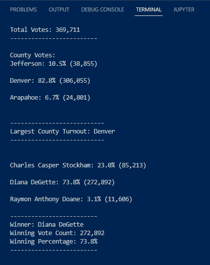
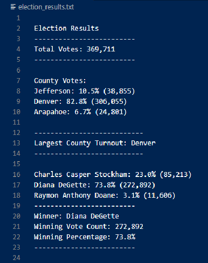

# Python_Election_Analysis

## Background

The client (The Colorado Board of Elections) is interested in performing an election audit using python.

## Project Overview

An analysis of election results using python to read in a csv file and provide the following deliverables:

* The election results printed to the command line (Fig 1.2).
* The election results saved to a Text file (Fig 1.3).
* A written Analysis of the election Audit.

### Overview of Election Audit

A Colorado Board of Elections employee has given us the following task to complete the election audit of a recent local congressional election. 

1. Calculate the total number of votes cast.
2. Calculate the total number of votes for each county.
3. Calculate the percentage of total votes for each county.
4. Determine which county had the largest number of votes.
5. Get a complete list of candidates who received votes.
6. Calculate the total number of votes each candidate won.
7. Calculate the percentage of votes each candidate won.
8. Determine the winner of the election based on popular votes.

The output of our analysis should be similar to Figure 1.1.

&nbsp;

#### Figure 1.1 Expected outcome example

&nbsp;

## Resources

* Data source: election_result.cvs
* Software: Python 3.7.6, Visual Studio Code 1.68.1

## Election-Audit Results

The analysis of the election show that:

* There were (**369,711**) total votes cast in the election.

* The counties results were as follow:
  * Jefferson: 10.5% (38,855)
  * Denver: 82.8% (306,055)
  * Arapahoe: 6.7% (24,801)
 
 * The county with the the largest number of votes was:
 
   * **Denver**
 
* The candidates were:

  * Charles Casper Stockham
  * Diana DeGette
  * Raymon Anthony Doane

* The candidate results were:

  * Charles Casper Stockham: 23.0% (85,213)
  * Diana DeGette: 73.8% (272,892)
  * Raymon Anthony Doane: 3.1% (11,606)

* The winner of the election was:

  * Candidate (**Diana DeGette**), who received 73.8% of the votes and (272,892) number of votes.

### Results as recorded in my election_analysis file

#### Figure 1.2 Election audit results printed to command line

&nbsp;

#### Figure 1.3 Election audit results saved to text file

&nbsp;

## Election-Audit Summary

Pre-tested code reduces the risk of failure because we are reusing a code that has been already used and is proven to work. The python code provided is robust and can be used for any state-wide election, given the following:

  1. A separate csv file is used for each election.
  2. Record all the results for each election in a separate “analysis file”. In that way we assure that we won't be overwriting any data.
  3. The code does not "hard wire" any candidates or counties and can be used for any state wide election. This ensures flexibility in our code so that it can be used in future projects with minor alterations.
  4. Since this is a robust working code, don't write lines of code that are not needed, and follow the DRY principle of “Don't repeat yourself.” That way we assure that the code is still functional with minimal alterations.  

&nbsp;

[Markdown reference 1](https://docs.github.com/en/get-started/writing-on-github/getting-started-with-writing-and-formatting-on-github/basic-writing-and-formatting-syntax)

[Markdown reference 2](https://www.markdownguide.org/basic-syntax/)

[Reuse code reference](https://www.crowdbotics.com/blog/how-to-maximize-code-reuse-across-projects)
