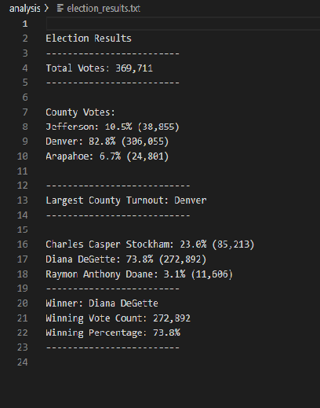

# Election_Analysis

## Project Overview

Analysis of election results using python to read in a csv file and provide the following deliverables:

1.The election results printed to the command line. 
2.The election results saved to a Text file. 
3.A written Analysis of the election Audit. 

## Overview of Election Audit

A colorado Board of Elections employee has given you the following task to completebthe election audit of a recent local congressional election.

* Calculate the total number of votes cast
* Get a complete list of candidates who recieved votes.
* Calculate the total number of votes each candidate won.
* Calculate the ercentage of votes each candidate won.
* Determine the winner of the election based on popular votes.

## Resources

* Data source: election_result.cvs
* Software: Python 3.7.6, Visual Studio Code 2.3.5

## Summary

### Eletion-Audit Results

The Analysis of the election show that:

* There were "369,711" total votes cast in the election.

* The candidate were:

    * Charles Casper Stockham
    * Diana DeGette
    * Rayman Anthony Doane

- The candidate results were:

    * Charles Casper Stockham: 23.0% (85,213)
    * Diana DeGette: 73.8% (272,892)
    * Raymon Anthony Doane: 3.1% (11,606)

* The winner of the election was:

    * Candidate (Diana DeGette), who recieved 73.8% of the votes and (272,892) number of votes.

## Results as recorded in my election_analysis.text file

## Election-Audit Challenge Summary

The python cod eprovided is Robust and can be used for any state wide elections given the follow:
    1. Need a separate csv file for each election
    2. Need a separate analysis file to record all the results.
    3. The code does not  "hard wire" any candidates or counties and can be used or any state wide elections.

## Challenge Overview
